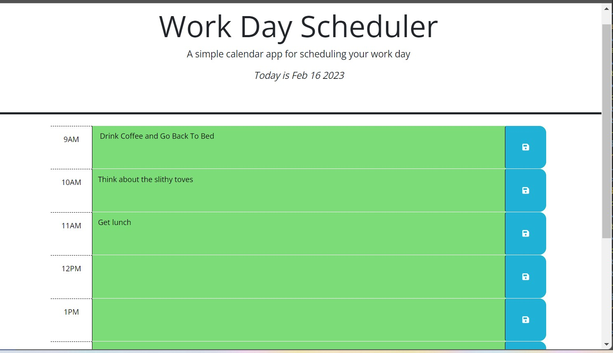

## Module 2 Challenge (Columbia Bootcamp)
    

# Description
A smart, adaptive scheduler app that uses jQuery, dayjs, bootstrap, css, html, vanilla JavaScript, local storage, and clever thinking. One can visit the site to see the current date automatically updated and a business-hour grid for listing to-dos, meetings, etc. for each hour-block of time. The scheduler automatically changes the background-color of a given time-block by comparing the hour of the time-block to the current hour - automatically updated for you. Need to come back and check your to-do list or appointments? The scheduler app utilizes local storage so you can easily save whatever you type in for each block in the schedule - it will be waiting for you when you come back to the app later! 
This project is hw assignment #5 for Columbia University's fullstack software dev bootcamp, and features some starter code (most of the html and css) so it is primarily a test of basic JavaScript and related tools like jQuery and dayjs. The project adheres to the following acceptance criteria:

The deployed page is: https://jdr8888.github.io/smart-scheduler/

The github repo is @ https://github.com/JDR8888/smart-scheduler

Screenshot of the page:

# Installation
N/A
# Usage
N/A
# Credits
giphy.com; forthebadge.com; Columbia U;
# License
Please see the repo for license info